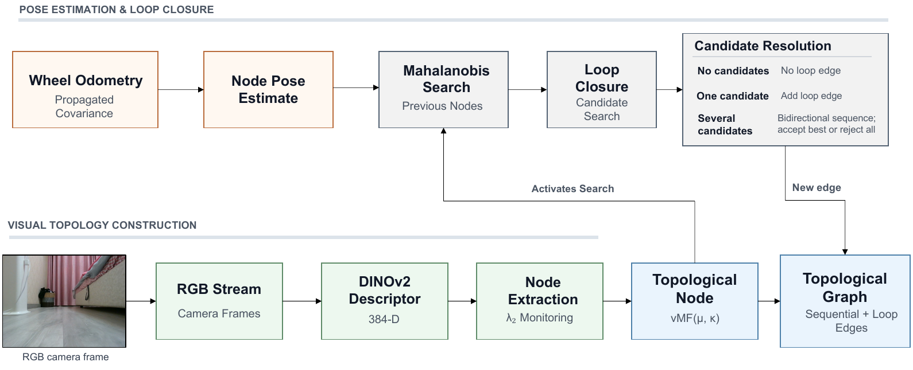
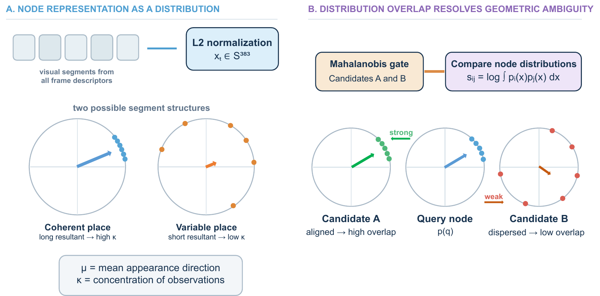

# TopoSIGMA

**Topo**logical **S**pectral **I**nformation-**G**eometric **M**apping **A**rchitecture

TopoSIGMA is an online, training-free visual topological mapping system for
ROS 2. It turns synchronized camera and wheel-odometry streams into a compact
place graph while treating node formation and loop closure as separate
inference problems.



The system uses a frozen DINOv2 encoder and contains no learned
dataset-specific state. Algebraic connectivity in a sliding visual graph
identifies place transitions. For each completed segment, all normalized frame
descriptors are fitted with a von Mises--Fisher (vMF) distribution. Loop
closure is geometry-first: propagated odometry covariance supplies physically
compatible candidates, and bidirectional vMF sequence evidence is used only
when several candidates remain.

An optional CLIP module supports open-vocabulary text-to-node retrieval after
the map has been built. It does not influence node creation or loop closure.

## Highlights

- Online node extraction from valleys of spectral algebraic connectivity.
- Covariance-aware loop-candidate search using Mahalanobis compatibility.
- Training-free directional node models that preserve appearance dispersion.
- Separate sequential and loop edges, with explicit loop-closure metrics.
- Dataset-independent mapping core and ROS topic interface.
- Reproducible COLD and CID-SIMS experiment runners with resumable ablations.
- Optional AnyLoc-GeM comparison and CLIP text-to-node retrieval.



## Repository structure

```text
.
├── assets/readme/                  README figures
├── docs/                           Baseline and ablation notes
├── encoder/                        Local datasets (ignored by Git)
└── vts_devcontainer/
    ├── .devcontainer/              Ubuntu 24.04 / ROS 2 Jazzy environment
    ├── pyproject.toml               Python dependency declaration
    ├── uv.lock                      Reproducible dependency lock
    └── vts_ws/
        ├── run_experiments.sh       COLD experiment suite
        ├── run_cid_sims_experiments.sh
        ├── run_anyloc_baseline.sh
        ├── evaluate_tolerance_sweep.sh
        ├── evaluate_node_segmentation.sh
        └── src/
            ├── vts_core/            Dataset-independent algorithms
            ├── vts_players/         COLD and CID-SIMS adapters
            ├── vts_mapping/         ROS graph-builder node
            ├── vts_language/        Text-to-node retrieval node
            ├── vts_evaluation/      Metrics and publication figures
            └── vts_bringup/         Launch file and experiment configs
```

The package-level architecture and ROS interface are documented in
[`vts_devcontainer/vts_ws/src/README.md`](vts_devcontainer/vts_ws/src/README.md).

## Requirements

The supported environment is the included development container:

- Docker Desktop or Docker Engine;
- a development-container client such as Visual Studio Code with the
  Dev Containers extension;
- enough disk space for the selected datasets and model cache.

The image uses Ubuntu 24.04, ROS 2 Jazzy, CPython 3.12, and dependencies locked
with uv. ROS 2 Jazzy's binary Python extensions require the Ubuntu 24.04 Python
ABI, so the container intentionally does not install a separate Python 3.13
interpreter.

## Dataset setup

The datasets are not redistributed. Download them under `encoder/`, which is
mounted at `/workspace/encoder` inside the container.

### COLD

Download the Freiburg and Saarbruecken sequences from the
[COsy Localization Database](https://www.cas.kth.se/COLD/). The supplied
configurations use these four traversals:

```text
encoder/seq_data/
├── cold-freiburg_part_a_seq2_night1/
├── cold-freiburg_part_b_seq3_sunny1/
├── cold-saarbruecken_part_a_seq2_night2/
└── cold-saarbruecken_part_b_seq4_sunny1/
```

Each extracted traversal must retain the original `std_cam/`, `odom_scans/`,
and `localization/` directories.

### CID-SIMS

Download CID-SIMS from
[Science Data Bank](https://doi.org/10.57760/sciencedb.ai.00003) and extract
the first traversal from each apartment as follows:

```text
encoder/
├── apartment1_1/
│   ├── color/
│   ├── groundtruth.txt
│   └── odom.txt
├── apartment2_1/
└── apartment3_1/
```

The CID-SIMS runner validates the expected files, image availability, and
freshness of generated graphs before accepting a run.

## Build

Open `vts_devcontainer/` in the development container, then run:

```bash
cd /workspaces/visual_topological_slam/vts_devcontainer/vts_ws

colcon build --symlink-install \
  --packages-select vts_core vts_players vts_mapping \
  vts_evaluation vts_bringup vts_language

source install/setup.bash
```

The first mapping run downloads the selected pretrained model through
PyTorch Hub or Hugging Face and caches it inside the container user's home
directory.

## Run TopoSIGMA

Build one COLD map:

```bash
ros2 launch vts_bringup pipeline.launch.py \
  config:=cold_freiburg_a.yaml mode:=building
```

Query the completed map with the sentence configured in the same YAML file:

```bash
ros2 launch vts_bringup pipeline.launch.py \
  config:=cold_freiburg_a.yaml mode:=command
```

Environment-specific inputs and output paths live in
`vts_bringup/config/*.yaml`; the mapping algorithms do not access datasets
directly.

## Reproduce the experiments

Run the final configuration on all four COLD traversals and all three
CID-SIMS traversals:

```bash
FORCE=1 RUN_ABLATIONS=0 ./run_experiments.sh
FORCE=1 RUN_ABLATIONS=0 ./run_cid_sims_experiments.sh
```

After checking the main runs, generate the visual-only, geometric-only, and
fixed-threshold ablations without rebuilding completed maps:

```bash
SKIP_EXISTING=1 RUN_ABLATIONS=1 ./run_experiments.sh
SKIP_EXISTING=1 RUN_ABLATIONS=1 ./run_cid_sims_experiments.sh
```

Both runners accept environment names as positional filters. For example:

```bash
FORCE=1 ./run_experiments.sh freiburg_a
FORCE=1 ./run_cid_sims_experiments.sh apartment1_1
```

Run the computationally matched AnyLoc-GeM comparison with:

```bash
./run_anyloc_baseline.sh all
```

Once the seven main maps exist, re-score the unchanged graphs at ground-truth
distance tolerances of 0.5, 1, 2, and 3 m:

```bash
./evaluate_tolerance_sweep.sh
```

This offline sweep does not rerun mapping or overwrite the primary reports.
It evaluates both TopoSIGMA and the AnyLoc-GeM ViT-S baseline, and writes
`loop_tolerance_sweep.json` and `loop_tolerance_sweep.csv` under
`output/revised/`. To score the existing gate ablations as well, run
`INCLUDE_ABLATIONS=1 ./evaluate_tolerance_sweep.sh`. If the AnyLoc artifacts
have not been generated, they may be omitted explicitly with
`INCLUDE_ANYLOC=0`.

Evaluate the adaptive node-creation rule from the saved algebraic-connectivity
traces, including a sensitivity sweep over `k = {1, 1.5, 2, 2.5, 3}`:

```bash
./evaluate_node_segmentation.sh
```

This second offline experiment compares the final adaptive detector with the
same hysteresis using a constant prominence. The constant is calibrated only
on Freiburg A to match the final method's node count, without using room
labels, and is then frozen for every other environment. Results are written to
`node_segmentation_experiment.json` and `node_segmentation_experiment.csv`
under `output/revised/`; existing maps and reports remain unchanged.

To measure how node granularity propagates into loop closure and map quality,
run the end-to-end sensitivity suite. It preserves the existing adaptive
`k=2` maps and creates four additional adaptive settings plus a calibrated
fixed-prominence baseline in suffixed output directories:

```bash
./run_node_sensitivity_experiments.sh
```

The suite is resumable. Use `FORCE=1` only when every sensitivity variant
should intentionally be rebuilt.

See [`docs/ANYLOC_BASELINE.md`](docs/ANYLOC_BASELINE.md) for the exact and
ViT-S-matched configurations, and [`docs/VMF_VALIDATION.md`](docs/VMF_VALIDATION.md)
for the preserved cosine comparison.

## Outputs

Runs write to `vts_devcontainer/vts_ws/output/revised/`. This directory is
ignored by Git because graph pickles and generated figures are reproducible
artifacts. Each main environment contains:

```text
output/revised/<environment>/
├── final_graph.pkl
├── graph_0_noopt.pkl
├── graph_0_node_gt.json
├── graph_0_performance.json
├── metrics_report.json
├── noopt_report.json
└── figures/
    ├── topological_map.pdf
    ├── lambda2_valleys.pdf
    └── recorded_odometry.pdf
```

The suite also writes aggregate `summary.json`, `mapping.csv`,
`gate_ablation.csv`, `retrieval.csv`, and `runtime.csv` files directly under
`output/revised/`.

## Using another dataset or robot

TopoSIGMA consumes standard ROS messages rather than dataset files. A new
adapter or robot must publish:

| Topic | Message | Purpose |
|---|---|---|
| `/camera/image` | `sensor_msgs/Image` | BGR camera frame |
| `/odom` | `nav_msgs/Odometry` | Planar pose with meaningful covariance |
| `/dataset/sequence_done` | `std_msgs/String` | End-of-run JSON event |
| `/ground_truth_pose` | `geometry_msgs/PoseStamped` | Optional evaluation metadata |
| `/dataset/room_label` | `std_msgs/String` | Optional evaluation metadata |

Camera and odometry messages must share a clock. Ground truth and room labels
are never used for mapping decisions.

## Compute device

`dino_device:=auto` selects CUDA, then Apple Metal Performance Shaders (MPS),
then CPU according to the active PyTorch runtime. A Linux container running
through Docker Desktop on macOS cannot access MPS and therefore uses CPU.
CUDA requires a compatible NVIDIA host, the NVIDIA Container Toolkit, and GPU
access for the container. The selected device is logged at startup and can be
overridden explicitly:

```bash
ros2 launch vts_bringup pipeline.launch.py \
  config:=cold_freiburg_a.yaml dino_device:=cpu
```

## Development and validation

From the built and sourced workspace:

```bash
python3 -m pytest -q src/vts_core/test src/vts_players/test

# Static checks (run from vts_devcontainer/):
cd /workspaces/visual_topological_slam/vts_devcontainer
uvx ruff check vts_ws/src
```

Runtime dependencies are declared in `vts_devcontainer/pyproject.toml` and
reproduced from `vts_devcontainer/uv.lock`. To intentionally update one
dependency, run `uv lock --upgrade-package <package>` from
`vts_devcontainer/`, rebuild the container, and rerun the complete test suite.

## Citation

If TopoSIGMA contributes to your work, please cite the accompanying paper.
Machine-readable project metadata are provided in [`CITATION.cff`](CITATION.cff).

## License

TopoSIGMA is released under the [MIT License](LICENSE). Dataset and pretrained
model licenses remain with their respective authors.
