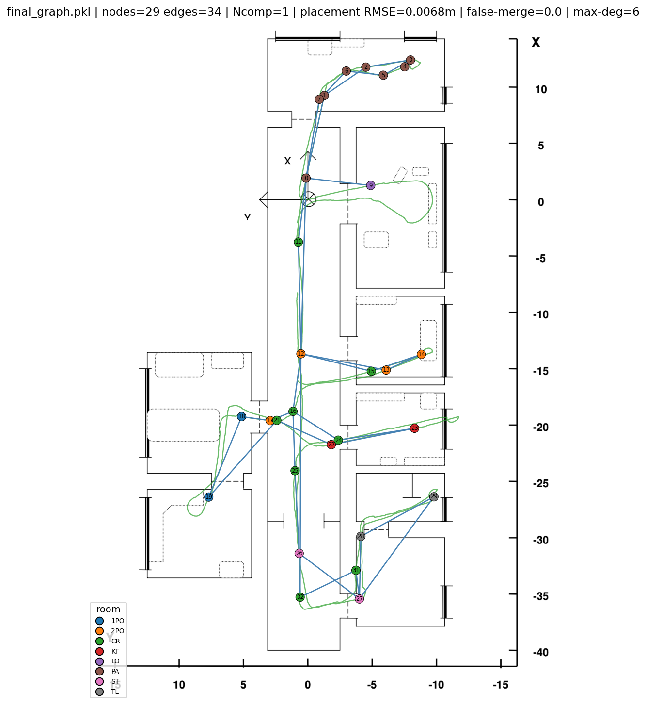
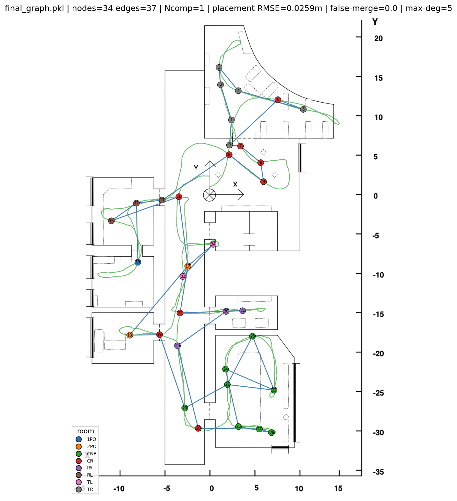
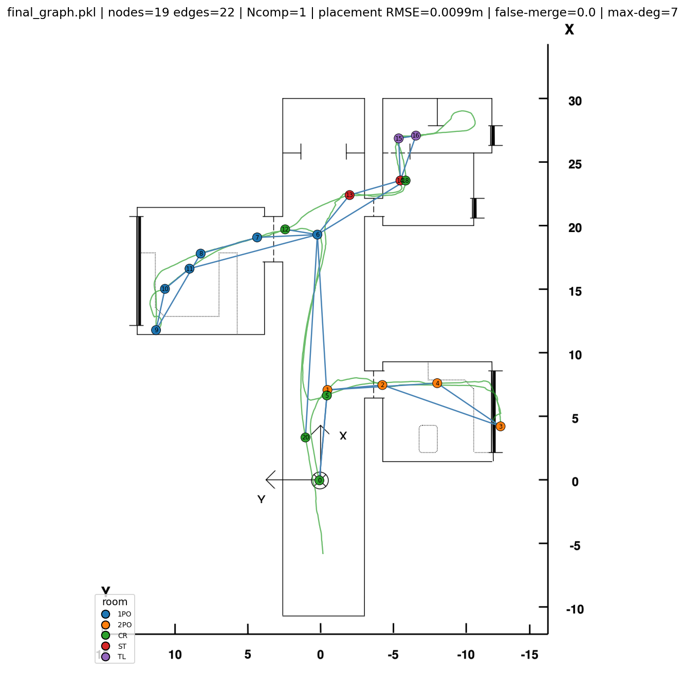
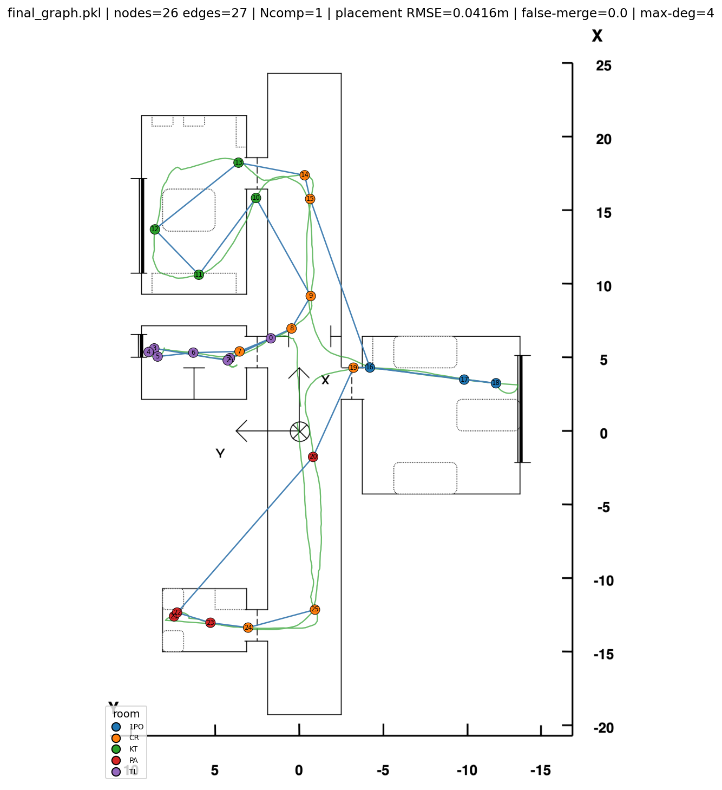

# LANTERN — LANguage Topological Environment Representation and Navigation

<table align="center">
  <tr>
    <td align="center"><br/><em>Freiburg A</em></td>
    <td align="center"><br/><em>Saarbrücken A</em></td>
  </tr>
  <tr>
    <td align="center"><br/><em>Freiburg Extended</em></td>
    <td align="center"><br/><em>Saarbrücken Extended</em></td>
  </tr>
</table>

LANTERN is a single-run pipeline that builds a topological map of an indoor environment from a **monocular camera stream and odometry**, and exposes it to **natural-language navigation queries** — a topological map you can talk to. Images are encoded with a fine-tuned vision transformer; nodes are created by monitoring the algebraic connectivity of a sliding-window similarity graph; revisits are fused only when a robust visual outlier test and a covariance-aware geometric gate agree, which keeps the graph connected and free of false merges. A CLIP-based module grounds open-vocabulary free-text queries to the most relevant node.

On four COLD environments the system produces single-component graphs with false merges almost entirely suppressed, and its place descriptor reaches 95.0 AR@1 across strong illumination changes. It is compared against the state-of-the-art topological mapper [PRISM-TopoMap](https://arxiv.org/abs/2404.01674) at two levels: against its published metric classes, and head-to-head by running its public implementation on the same COLD sequences with identical odometry (see [`prism_comparison/`](prism_comparison/)).

**Authors:** Manuel Rodríguez Villegas, Jaime Boal Martín-Larrauri, Jesús Tordesillas Torres

**School:** ICAI School of Engineering (Comillas Pontifical University)

**Year:** 2026

---

## Table of Contents

- [Overview](#overview)
- [Results](#results)
- [Repository Structure](#repository-structure)
- [Reproducing the Experiments](#reproducing-the-experiments)
  - [1. Requirements](#1-requirements)
  - [2. Dataset](#2-dataset)
  - [3. Encoder Training](#3-encoder-training)
  - [4. Building the ROS 2 Workspace](#4-building-the-ros-2-workspace)
  - [5. Building a Map](#5-building-a-map)
  - [6. Evaluating a Map](#6-evaluating-a-map)
  - [7. Place-Recognition Recall](#7-place-recognition-recall)
  - [8. Natural-Language Queries](#8-natural-language-queries)
  - [9. Floorplan Overlays (optional)](#9-floorplan-overlays-optional)
- [Configuration Reference](#configuration-reference)
- [Citation](#citation)

---

## Overview

Topological maps represent an environment as a graph, where nodes correspond to points of interest and edges represent traversable paths. Compared to metric maps, they are computationally lighter, more robust to odometry error, and integrate naturally with language modules.

The pipeline processes one synchronized `(image, odometry pose, covariance)` sample per frame:

1. **Feature extraction** — a DINOv2-Small encoder with a projection head, fine-tuned with triplet or contrastive loss, produces a 128-D place descriptor per image.
2. **Node extraction** — the descriptors of the most recent frames form a similarity graph; the second-smallest eigenvalue of its normalized Laplacian (algebraic connectivity, λ₂) is tracked online, and a detected valley signals an appearance change that creates a node. Valleys are detected with an adaptive, MAD-based margin rather than an absolute similarity threshold.
3. **Revisit detection and fusion** — a candidate node is merged into an existing one only if it is (a) a mutual visual nearest neighbour that stands out as a robust MAD-based outlier over all other nodes, **and** (b) geometrically compatible under a covariance-aware gate. The fused node's descriptor is left unchanged, so one wrong merge cannot cascade into map-wide aliasing.
4. **Language grounding** — each node stores up to three representative views embedded with CLIP; at query time, a sentence embedding retrieves the best-matching node, with calibrated rejection of ambiguous queries.

The mapper is dataset-agnostic: it only consumes standard ROS 2 topics, and a small *player* node adapts each dataset (or a real robot) to that interface. When a dataset lacks usable odometry, the player synthesizes it from ground truth with the standard probabilistic motion model, whose noise level is an explicit config parameter (`alpha`, zero = drift-free).

Full details in the paper (see [Citation](#citation)).

## Results

Structural quality of the single-run maps. Odometry is synthesized from ground truth with the standard probabilistic motion model (noise `alpha = [0.025, 0.005, 0.01, 0.0025]`, seed 17), used continuously as the local motion estimate and re-anchored at every confirmed loop closure; the placement RMSE reflects the drift accumulated between re-anchoring events.

| Environment | Nodes | Edges | Components | Placement RMSE (m) | False merges |
|---|---|---|---|---|---|
| Freiburg A | 25 | 28 | 1 | 7.75 | 0.07 |
| Freiburg Ext. | 21 | 23 | 1 | 4.11 | 0.00 |
| Saarbrücken A | 25 | 24 | 1 | 7.42 | 0.00 |
| Saarbrücken Ext. | 18 | 18 | 1 | 2.49 | 0.00 |

Place-recognition Average Recall (%, 5 m threshold, mean over the four environments): **81.0 AR@1 / 91.7 AR@5** within-run, **95.0 AR@1 / 98.6 AR@5** across illumination conditions (database and queries from different sessions of the same route). Graph maintenance runs at **0.32 ms/frame** (excluding the encoder forward pass) and the descriptors-only map occupies **~13 kB**.

In the head-to-head comparison ([`prism_comparison/`](prism_comparison/)), PRISM-TopoMap run on the same sequences with identical odometry also produces connected maps with comparable metric distortion, but its LiDAR-native place recognition (MinkLoc3D trained on 3D LiDAR) drops to a mean 41.0 AR@1 on COLD's planar range data — against 81.0 for this system's monocular descriptor — with false-merge rates up to 0.23. Vertically extruding the 2D scans to mimic 3D structure does not close the gap.

## Repository Structure

```
visual_topological_slam/
├── encoder/                    # Encoder training and evaluation (PyTorch)
│   └── src/
│       ├── config.py           # Hyperparameters and loss selection
│       ├── train.py            # python -m src.train
│       └── evaluate.py         # python -m src.evaluate
├── vts_devcontainer/           # VS Code devcontainer (ROS 2 Humble)
│   └── vts_ws/                 # ROS 2 workspace
│       ├── src/
│       │   ├── vts_core/       # Pure-Python algorithm library (no ROS imports)
│       │   ├── vts_players/    # COLD dataset player (the only COLD-aware code)
│       │   ├── vts_mapping/    # graph_builder node (image + odom → TopoGraph)
│       │   ├── vts_language/   # commands node (natural-language queries)
│       │   ├── vts_evaluation/ # Offline metrics CLIs
│       │   ├── vts_viz/        # Visualization helpers
│       │   └── vts_bringup/    # pipeline.launch.py + per-environment configs
│       └── queries_example.json
├── prism_comparison/           # Head-to-head PRISM-TopoMap baseline on COLD
│   ├── driver/                 # Deterministic offline replay of their pipeline
│   ├── eval/                   # Same-metrics evaluation + floorplan overlays
│   ├── tools/                  # COLD → input-bundle converter
│   └── vendor/                 # Pinned-commit fetch script + device patch
├── docs/                       # Cover images
├── Dockerfile
└── requirements.txt
```

## Reproducing the Experiments

### 1. Requirements

- Docker + VS Code with the Dev Containers extension (the ROS 2 Humble environment is fully containerized).
- A CUDA GPU is recommended for encoder training; mapping and evaluation run on CPU.
- Python dependencies inside the container: `numpy`, `scipy`, `opencv-python`, `torch`, `torchvision`, `transformers`, `pillow`, `pyyaml`.

### 2. Dataset

Download the [COLD database](https://www.cas.kth.se/COLD/) (Freiburg and Saarbrücken laboratories) and place the sequences under `encoder/seq_data/`, keeping the standard COLD layout:

```
encoder/seq_data/
└── cold-freiburg_part_a_seq2_night1/
    ├── std_cam/                      # t<...>_x<...>_y<...>_a<...>.jpeg frames
    └── localization/places.lst       # per-frame room labels
```

Frame filenames carry the ground-truth pose; `places.lst` provides the room labels used for evaluation. The sequences used in the paper:

| Environment | Mapping sequence | Cross-illumination queries |
|---|---|---|
| Freiburg A | `cold-freiburg_part_a_seq2_night1` | `..._seq2_cloudy1`, `..._seq2_sunny1` |
| Freiburg Ext. | `cold-freiburg_part_b_seq3_sunny1` | `..._seq3_cloudy3` |
| Saarbrücken A | `cold-saarbruecken_part_a_seq2_night2` | `..._seq1_cloudy2` |
| Saarbrücken Ext. | `cold-saarbruecken_part_b_seq4_sunny1` | `..._seq3_cloudy1` |

### 3. Encoder Training

Set the loss function (`triplet` or `contrastive`) and hyperparameters in `encoder/src/config.py`, then from `encoder/`:

```bash
python -m src.train      # writes weights to encoder/models/
python -m src.evaluate   # embedding-space evaluation (UMAP, accuracy)
```

The mapping configs reference the contrastive checkpoint `visual_encoder_dino_contrastive_dim128_best`. Both losses yield indistinguishable downstream results.

### 4. Building the ROS 2 Workspace

Open `vts_devcontainer/` in VS Code and reopen in container (it mounts `encoder/` at `/workspace/encoder`, which the configs expect). Then:

```bash
cd vts_ws
colcon build --symlink-install
source install/setup.bash
```

`--symlink-install` links configs and Python sources, so edits take effect without rebuilding.

### 5. Building a Map

One environment per config file (`vts_bringup/config/cold_<env>.yaml`). For Freiburg A:

```bash
ros2 launch vts_bringup pipeline.launch.py config:=cold_freiburg_a.yaml mode:=building
```

This plays the sequence, builds the graph online, and writes to `output/freiburg_a/`:

- `final_graph.pkl` — the topological map,
- `graph_0_node_gt.json` — per-node ground truth (evaluation only),
- `graph_0_performance.json` — map-update / loop-closure timings and map size.

Repeat with `cold_freiburg_ext.yaml`, `cold_saarbruecken_a.yaml`, `cold_saarbruecken_ext.yaml`. The committed configs use the noisy synthesized odometry of the published results (`alpha: [0.025, 0.005, 0.01, 0.0025]`, `odom_seed: 17`); set `alpha` to zeros for a drift-free replay, or raise it to study stronger drift.

### 6. Evaluating a Map

```bash
python3 -m vts_evaluation.evaluate_run \
    --graph output/freiburg_a/final_graph.pkl \
    --node-gt output/freiburg_a/graph_0_node_gt.json \
    --gt-trajectory /workspace/encoder/seq_data/cold-freiburg_part_a_seq2_night1/std_cam \
    --queries queries_example.json
```

Prints a metrics JSON (nodes, edges, connected components, placement RMSE, false-merge rate, degree statistics, retrieval metrics) and saves map renderings under `output/freiburg_a/images/`. Add `--floorplan images/maps/freiburg_a.png` for the floorplan overlay (see [step 9](#9-floorplan-overlays-optional)).

### 7. Place-Recognition Recall

Evaluates the encoder with PRISM-TopoMap's protocol (Average Recall@1/@5 within a distance threshold):

```bash
python3 -m vts_evaluation.place_recognition_eval \
    --db /workspace/encoder/seq_data/cold-freiburg_part_a_seq2_night1/std_cam \
    --queries /workspace/encoder/seq_data/cold-freiburg_part_a_seq2_cloudy1/std_cam \
              /workspace/encoder/seq_data/cold-freiburg_part_a_seq2_sunny1/std_cam \
    --extractor finetuned:src \
    --model-name visual_encoder_dino_contrastive_dim128_best \
    --encoder-path /workspace/encoder \
    --cache-dir /tmp/pr_desc --within \
    --out output/freiburg_a/pr_recall.json
```

Reports both regimes: `within` (query and database from the same traversal, near-in-time self-matches excluded) and cross-illumination (database vs. other sessions). **Do not list the database sequence among `--queries`** — matching a session against itself scores a meaningless 100 %. Descriptors are cached, so re-runs with different thresholds are instant.

### 8. Natural-Language Queries

One-shot (set `query_sentence` in the config's `language` section):

```bash
ros2 launch vts_bringup pipeline.launch.py config:=cold_freiburg_a.yaml mode:=command
```

Results (ranked nodes, posteriors, representative views) are written to `output/freiburg_a/commands/`. For live queries set `language.mode: topic` in the config and publish:

```bash
ros2 topic pub --once /language/command std_msgs/String "{data: 'take me to the kitchen'}"
```

### 9. Floorplan Overlays (optional)

Overlaying maps on the CAD floorplans requires a one-time, per-environment calibration (COLD poses are not metrically aligned with the drawings). Place the floorplan PNGs under `vts_ws/images/maps/` and run the interactive fitter:

```bash
python3 -m vts_evaluation.calibrate_floorplan --interactive \
    --gt-trajectory /workspace/encoder/seq_data/<sequence>/std_cam \
    --floorplan images/maps/<env>.png
```

Click the true location of each numbered point; a thin-plate-spline calibration sidecar (`<env>.calib.json`) is written next to the image. Note: the Saarbrücken A floorplan is drawn with transposed axes — add `--swap-xy --flip-x`.

## Configuration Reference

Each `vts_bringup/config/cold_<env>.yaml` exposes the experiment knobs:

| Key | Section | Meaning |
|---|---|---|
| `sequences` | player | COLD sequence to play |
| `alpha` | player | Odometry motion-model noise (`[0,0,0,0]` = drift-free) |
| `odom_seed` | player | RNG seed for the odometry simulator (reproducibility) |
| `window_size` | mapping | Sliding window for the connectivity monitor |
| `valley_k` | mapping | Node-creation sensitivity (lower → more nodes) |
| `merge_radius` | mapping | Radius (m) within which a visually-confirmed revisit merges |
| `visual_outlier_k` | mapping | Strictness of the visual revisit gate (lower → easier merges) |
| `extractor`, `model_name`, `encoder_path` | mapping | Encoder selection |
| `query_sentence`, `mode`, `top_k` | language | Language-module behaviour |

## Citation

If you use this work in your research, please cite:

```bibtex
@thesis{rodriguez2026vts,
  title   = {Visual Topological SLAM using Deep Learning Techniques},
  author  = {Rodríguez Villegas, Manuel and Boal Martín-Larrauri, Jaime and Tordesillas Torres, Jesús},
  school  = {ICAI School of Engineering - Comillas Pontifical University},
  year    = {2026}
}
```
